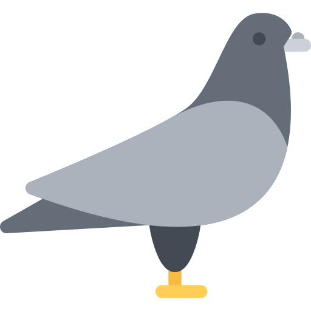

# pigeon-hill-range-status
 A system tray application that monitors Pigeon Hill Conservation Area in Missouri
# Pigeon Hill Range Status Monitor

A lightweight Qt6 system tray application that monitors the shooting range status at Pigeon Hill Conservation Area in Missouri.



## Features
- 🟢 **Green Circle with Checkmark** - Range is OPEN
- 🔴 **Red Circle with X** - Range is CLOSED
- ⚪ **Gray Circle** - Status unknown/checking

### Context Menu
- Check Now - Manual status refresh
- Open Website - Launch MDC page in browser
- Quit - Exit application

## Installation

### Option 1: Flatpak (Recommended)

```bash
# Install from Flathub (when published)
flatpak install flathub com.github.scramble45.PigeonHillRangeStatus

# Run the application
flatpak run com.github.scramble45.PigeonHillRangeStatus
```

### Option 2: Build from Source

#### Prerequisites
- Qt6 development libraries
- C++17 compatible compiler
- pkg-config

**Ubuntu/Debian:**
```bash
sudo apt install qt6-base-dev qt6-base-private-dev libqt6network6-dev build-essential pkg-config
```

**Fedora:**
```bash
sudo dnf install qt6-qtbase-devel qt6-qtnetwork-devel gcc-c++ pkgconfig
```

**Arch Linux:**
```bash
sudo pacman -S qt6-base qt6-networkauth gcc pkgconf
```

#### Build and Install
```bash
git clone https://github.com/scramble45/pigeon-hill-range-status.git
cd pigeon-hill-range-status
make
make install
```

The application will be installed to `~/.local/bin/pigeon-hill-range-status`.

### Option 3: Manual Build

```bash
# Generate moc file
/usr/lib/qt6/moc pigeon-hill-range-status.cpp -o pigeon-hill-range-status.moc

# Compile
g++ -std=c++17 -Wall -O2 -fPIC \
    $(pkg-config --cflags Qt6Core Qt6Widgets Qt6Network) \
    -Wl,--no-undefined \
    -o pigeon-hill-range-status \
    pigeon-hill-range-status.cpp \
    $(pkg-config --libs Qt6Core Qt6Widgets Qt6Network)
```

## Usage

### Starting the Application
```bash
pigeon-hill-range-status
```

The application will start minimized to the system tray. Look for the icon in your system tray area.

### System Tray Interactions
- **Left Click** - Show tooltip with current status and last check time
- **Middle Click** - Force immediate status check
- **Right Click** - Open context menu

### Auto-start on Login
To start automatically when you log in, create a desktop entry:

```bash
mkdir -p ~/.config/autostart
cat > ~/.config/autostart/pigeon-hill-range-status.desktop << EOF
[Desktop Entry]
Type=Application
Name=Pigeon Hill Range Status
Exec=$HOME/.local/bin/pigeon-hill-range-status
Hidden=false
NoDisplay=false
X-GNOME-Autostart-enabled=true
EOF
```

## How It Works

The application monitors the [Pigeon Hill Conservation Area webpage](https://mdc.mo.gov/discover-nature/places/pigeon-hill-conservation-area) for closure alerts. The Missouri Department of Conservation posts red alert banners when the range is closed for maintenance, hunting seasons, or other reasons.

**Status Detection Logic:**
- 🟢 **OPEN** - No closure alerts found on the webpage
- 🔴 **CLOSED** - Alert banner contains keywords like "closed", "closure", or "prohibited"
- ⚪ **UNKNOWN** - Network error or unable to parse webpage

## Configuration

Currently, the application uses hardcoded settings:
- **Check Interval**: 2 hours
- **Website URL**: MDC Pigeon Hill Conservation Area page
- **Timeout**: Standard Qt network timeout

Future versions may include a configuration file for customization for additional ranges.

## Contributing

Contributions are welcome! Please feel free to submit issues, feature requests, or pull requests.

## License

This project is licensed under the MIT License - see the [LICENSE](LICENSE) file for details.

## Acknowledgments

- Missouri Department of Conservation for maintaining the Pigeon Hill Conservation Area
- Qt Framework for excellent cross-platform development tools
- The shooting sports community for inspiration

## Disclaimer

This application is not affiliated with the Missouri Department of Conservation. Always verify range status on the official website before visiting. Range conditions can change without notice.

## If you like this app

- Please pickup after yourself at the range.
- Leave the range in better shape than when you got there, a little goes long way.
- Be respectful of all MDC representives.
- Obey all posted rules and regulations at the range.
- Respect the four fundamental rules of gun safety at all times on the range.
- Communicate with those who are operating along side you.

## Support

- **Bug Reports**: [GitHub Issues](https://github.com/scramble45/pigeon-hill-range-status/issues)

---

**Happy Shooting! 🎯**